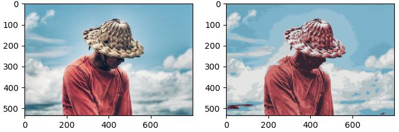

<h1 align="center"> Fuzzy Clustering </h1>

<h2 id="Description"> :book: Description</h2>

 a Numpy vectorized implementation written in Python of some of the fuzzy clustering algorithms, it includes the following:
 

 
<ul>
<li> ➤ Fuzzy C-Means  </li>
<li> ➤	Gustafason-Kessel  </li>
</ul>

<h3> Theoritical General Description of the Fuzzy Algorithm </h3>

 Fuzzy Clustering is a form of clustering in which each data point can belong to more than one cluster it involves assigning data points to clusters such that items in the same cluster are as similar as possible while items belonging to different clusters are as dissimiliar as possible. Clusters are identified via similarity measures. Different similarity measures may be used, in this implementation the euclidean distance and  Mahalanobis distance are used.

<h3> Comparison to hard Clustering </h3>

 
in non-fuzzy clustering, data is divided into distinct clusters, where each data point can only belong to exactly one cluster. In Fuzzy clustering, data points can potentially belong to multiple clusters.

<h3> The Algorithm: </h3>

<ol>
<li> Initialize Membership Matrix such that values across each center sum to 1</li>
<li> Update the Class Centers Matrix</li>
<li> Calculate the distances of samples from Class Centers</li>
<li> Update Memberships</li>
<li> Repeat step number 2 Until Convergence or reaching maximum number of iterations allowed</li>
</ol>

<h2 id="How to Install"> :floppy_disk: How to Install </h2>

 before installing the package its highly recommended that you create a virtual environment, there are many tools which are capable of that, such as  conda , venv ...etc. 
 here is an example of doing so using virtualenv: 

 First you install virtualenv 

<pre><code>$ pip install virtualenv </code></pre>

 Then create a folder where you can create your environment and cd into it  and then execute the following command: 

<pre><code>$ virtualenv env </code></pre>

 Now activate the environment 

<pre><code>$ \env\Scripts\activate.bat </code></pre>

 To Install the Package from PyPi, install pip then run the following code: 

<pre><code>$ pip install Fuzzy_Clustering </code></pre>

 OR if you want to also include dependencies which are necessery for running the examples, you must run the following:(Recommended) 

<pre><code>$ pip install Fuzzy_Clustering[examples] </code></pre>

<h2 id="Usage"> :pencil: Usage</h2>

 You can clone the repository and check into the examples folder,
 it provides two examples.

 The first example demonstrates how one can use fuzzy clustering to segment the color values within an into several distinct groups,
in the example below,Fuzzy C-Means was used with a parameterof 10 clusters. 

<pre><code>$ python fuzzy_image_segmentation.py </code></pre>

 
  

 The second example demonstrates the results of running the algorithm on a set of random scattered data points,
the algorithm was run several times with a varying number of clusters parameter.

<pre><code>$ python random_data_clustering.py </code></pre>

 
  

